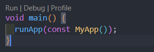

<h1 align="center">
  Quiz Simple App
</h1>

## Konten
- [Pengenalan](#pengenalan)
- [Installasi](#Cara-Instalasi-dan-Menjalankan-di-Local-Komputer)
- [Hasil Gambar](#Hasil-Gambar)
- [Fitur](#Fitur)
- [Teknologi Yang digunakan](#Teknologi-yang-digunakan)
- [Dependensi](#Dependensi)
- [Kontak](#Kontak)

## Pengenalan
Hallo everyone, ini adalah salah satu hasil kerja dan tugas saya dalam belajar pemrograman khususnya dalam bahasa **Dart** dan framework **Flutter** pada pengembangan lingkungan Mobile App

## Cara Instalasi dan Menjalankan di Local Komputer
1. Lakukan persiapan terlebih dahulu seperti instalasi framework flutter, dart SDK, Text Editor(VS Code, Atom, Android Studio), Java JDK dan yang lainnya, setelah semuanya ter-install silahkan buka `cmd` lalu ketikka `flutter doctor` untuk memastikan semuanya sudah sesuai, jika semuanya sesuai maka akan seperti pada gambar dibawah ini <br>
 <br> tolong hiraukan tanda silang tersebut karena tidak berpengaruh
2. Lakukan Clone atau Download pada link disini(```https://github.com/Siswadi24/Simple_Quiz_App.git)```
3. kemudian buka pada text editor anda masing-masing. 
4. Menuju file `pubspec.yaml` lalu lakukan `Ctrl + S` atau tekan tombol download di sebelah kanan atas seperti pada gambar dibawah ini<br>
5. Jalankan menggunakan perintah `flutter run` atau bisa menuju dokument `main.dart` lalu klik tombol `Debug` seperti pada gambar dibawah<br><br>
__*Jika masih bingung silahkan kunjungi website ini [cara menjalankan projek flutter dilocal komputer menggunakan Vs Code](https://piusaditya.medium.com/cara-clone-flutter-project-dari-github-menggunakan-visual-studio-code-3e165c2bef98)*__


## Hasil Gambar
Welcome Screen | Quiz Screen | Result Screen |
 |  |  

## Fitur
- Splash Screen
- Quiz Screen
- Result Screen

## Teknologi yang digunakan
- Flutter
- Dart

## Dependensi
- [google_fonts](https://pub.dev/packages/google_fonts)

## Kontak
Jika anda memiliki pertanyaan atau memiliki permasalahan dalam hal menjalankan atau yang lainnya, silahkan hubungi saya melalui email di *danaperdanaputra32@gmail.com* atau di [LinkedIn](https://www.linkedin.com/in/siswadi-perdana-putra-0b670a22b/)
